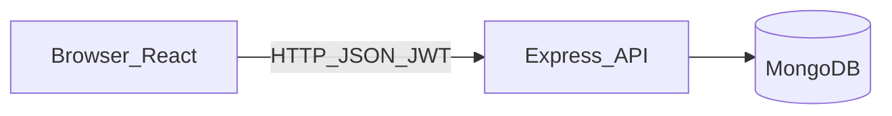
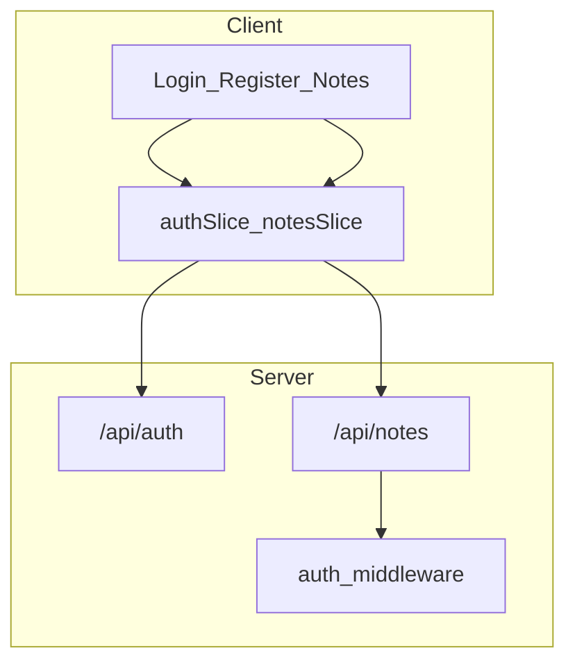

# NoteVault — System Design (Bootcamp)

Simple architecture — enough to explain in class or a demo.

## Context

| Piece | Job |
|-------|-----|
| React + Redux | UI + auth/notes state |
| Express | REST API + JWT middleware |
| MongoDB | Store users and notes |

---

## App shape

---

## Main flows

**Login:** form → `POST /api/auth/login` → save JWT → open notes page  

**Create note:** editor → `POST /api/notes` + Bearer token → server sets `userId` from JWT → save in Mongo  

**List notes:** `GET /api/notes` → only notes where `userId` = current user  

---

## API (v1)

| Method | Path | Auth |
|--------|------|------|
| POST | `/api/auth/register` | no |
| POST | `/api/auth/login` | no |
| GET | `/api/auth/me` | yes |
| GET | `/api/notes` | yes |
| GET | `/api/notes/:id` | yes |
| POST | `/api/notes` | yes |
| PUT | `/api/notes/:id` | yes |
| DELETE | `/api/notes/:id` | yes |

---

## Rule to remember

Always set `userId` from the JWT — never trust it from the request body.
